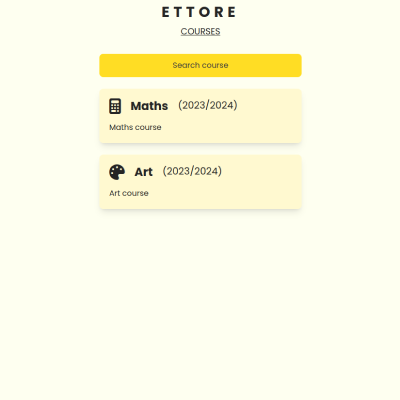
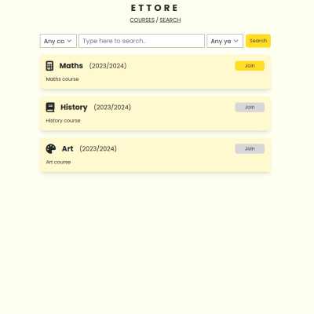
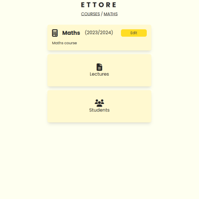
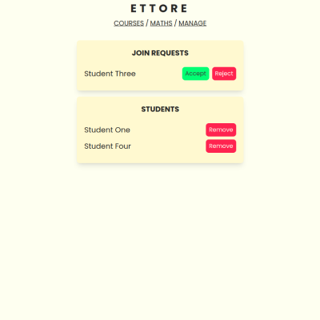
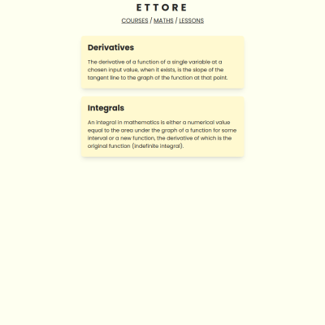
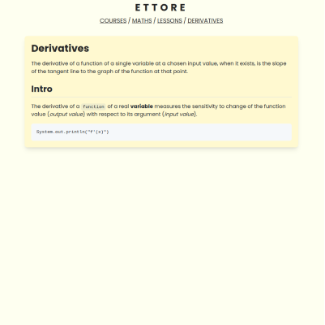

# Ettore

Ettore is a platform for e-learning where there are two very distinct types of users: professors and students.
Professors can create courses in which they can then upload lessons in Markdown format. In the other section, students
can ask to join courses and, once accepted, are able to look at the lessons available in the courses.

    
    

    
    

    
    

## Technology Stack

The project is written in Java 11 with the support of Gradle v6.3 as a build tool and Spring Boot as a web framework.
The database that we decided to use is H2 because it is an in-memory database and, therefore, is very easy to use. The
project follows a MVC pattern and it is divided in three main packages: `controller`, `model` and `templates` (which
make up our view). On the front-end side, we're using TailwindCSS as a CSS framework and Thymeleaf as a template engine.
For the testing phase we're using JUnit4 as the framework and Selenium specifically for end-to-end testing. The
Bonigarcia web driver manager was also used to automatically install the necessary browser drivers. Lombok is a
quality-of-life tool that spared us the effort of creating and maintaining boilerplate such as getters, setters,
constructors, etc.

## Development process

Initially, we conducted a meeting to discuss which of the proposed projects to develop and, eventually, we decided to go
with the e-learning platform. Then, we started writing the user stories and further developed their most interesting
subsections into more detailed scenarios as later explained below. Before starting with the actual development, we
created a Figma board on which we sketched out a basic design for the project. This helped us to have a clear idea of
how the project should look like. It also allowed us to better estimate the time required to develop each page in the
project, making it easier to divide the work among the members of the team and assigning tasks to each member as time
went on.

For managing the tasks, we created a Trello board where we divided the tasks and we assigned them to the members of the
team. We also decided to use the GitFlow workflow for coordinating the development on the repository hosted on GitHub.
We created a branch for each feature and we merged them into the `develop` branch once they were ready. During the
development phase we used Discord to communicate with each other and to coordinate the work every time that we felt the
need to do so. Each branch contains both the code and the tests that we wrote for that feature. For a branch to actually
be merged into `develop`, a Pull Request had to be opened by the author of the branch, and all other members of the team
had to review the code (possibly modifying or refactoring it) before finally approving the request. This ensured that
every member was aware of the code being introduced in the codebase and could asses the quality of it.

### CI/CD

To ensure the quality of our codebase at all times we made use of the free CI/CD platform provided by Github called
Github Actions. This allowed us to run the tests automatically every time a new commit was pushed to the repository or a
Pull Request was created. This way we could be sure that the code we were pushing was working and that it was not
breaking the existing codebase, giving us the peace of mind that the code provided by each member of the team was
working as expected. Combined with the Pull Requests workflow, this ensure a very high quality standard.

## Requirements

The Ettore platform must allow the following actions:

- User must be able to register and login on the platform as either a professor or a student
- Professor:

    - Must be able to create, edit and delete courses
    - Must be able to create, edit and delete lessons written in the Markdown format
    - Must be able to approve or reject course subscription requests coming from students
    - Must be able to inspect the list of students subscribed to a course, and possibly remove them

- Student:

    - Must be able to view the list of courses in which the student is enrolled in
    - Must be able to search for courses by title, description, year and category
    - Must be able to request to subscribe to a course
    - Must be able to view the lessons of the courses to which he/she is subscribed

## User Stories

### Story 1 - User registration, login and course creation (Gives rise to scenarios 1.1, 1.2 and 1.3)

Stefano is an ordinary professor and researcher at the Faculty of Computer Science of the University of Povegliano.
Stefano can't wait for the semester to begin because he will teach a course on Signal analysis for the first time ever.
Unfortunately, the University of Povegliano has not yet equipped itself with a system for e-learning, but Stefano would
like to share with his students some in-depth articles that he made himself on the geometric interpretation of the
Fourier and Zeta transformations. Sharing these contents via mail would be a feasible option, if only Stefano didn't
wish to edit the shared texts after publishing them, and welcoming new students without having to continuously send
mails. After some research on the web, Stefano discovers Ettore and decides to try it. **He registers by entering his
credentials _(1.1)_**. **Then after logging in Ettore _(1.2)_ he starts creating his course on the platform _(1.3)_.**

### Story 2 - Course search, course subscription request and approval by the professor (Gives rise to scenarios 2.1, 2.2 and 2.3)

Filippo is a student at the Academy of Fine Arts of Pacengo, after having attended a talk organized by Dr. Stefano on
low-level programming languages, and being fascinated by it, he decides to try to follow one of the courses taught by
the same professor. Filippo unfortunately does not have the opportunity to follow Stefano's lessons because he is from
another department but, after registering on Ettore, **he manages to find, through the dedicated search page, one of the
courses that interests him a lot _(2.1)_**: "High-performance neural networks in assembly". After entering the platform,
Filippo **subscribes to the course _(2.2)_** of the professor. The professor, remembering the numerous interventions
during the talk by Filippo, **accepts the course subscription _(2.3)_** to give Filippo the opportunity to explore this
new discipline.

### Story 3 - Lesson creation, viewing by students, and modification (Gives rise to scenario 3.1, 3.2 and 3.3)

Professor Stefano receives several emails from working students who were unable to follow the lesson in which the Fast
Fourier Transformation was explained. In addition, many other students have shown great interest on the subject.
Stefano, therefore, decides to take advantage of Ettore and **publishes, on the page of his course "Signal analysis",
several new lessons _(3.1)_** about the topic. The lessons are in Markdown text format and this allows Stefano to enrich
the content with images, videos, tables, mathematical formulas, etc. while remaining a simple text file. **After
publishing a lesson, the students enrolled in the course have the possibility to view it _(3.2)_** . However later that
day, Stefano realizes that one of the lessons had a typo in one of the formulas and decides to **modify the
lesson _(3.3)_**.

## Scenarios

### Scenario 1.1 - User registration

| Init Assumption    | A person who is not yet registered on the online Ettore platform, decides to create their own account.                                                                                                                                                                                                                                                                                                                                                                                                                                                                                                                                                                                                                                                                                                                                                                                    |
|--------------------|-------------------------------------------------------------------------------------------------------------------------------------------------------------------------------------------------------------------------------------------------------------------------------------------------------------------------------------------------------------------------------------------------------------------------------------------------------------------------------------------------------------------------------------------------------------------------------------------------------------------------------------------------------------------------------------------------------------------------------------------------------------------------------------------------------------------------------------------------------------------------------------------|
| Normal Functioning | The person goes on the Ettore homepage, displaying a login form. From this page he/she clicks on the "Register" button. At this point a form appears in which he/she is asked to enter the following information: first name, last name, email address, password, confirm password and, finally, whether to register as a professor or as a student. The selected mode will decide the actions that the user will be able to perform on the platform once registered. To send the form, the person presses the "Register" button. This is only active when: 1) All fields are filled 2) The email is in a valid format 3) The password is at least 8 characters long 4) The password and the confirm password match. The user is redirected to the page with the list of courses (courses taught if the user is a professor, otherwise subscribed courses) which will initially be empty. |
| What can go wrong  | There are one or more empty fields in the form. In this case the "Register" button cannot be pressed.  The email entered is not valid. For our purposes, an email address  is considered valid if it has visible characters both to the left and to the right of an `@` character. The check is done in real-time and the "Register" button is not clickable if the email does not satisfy the format just described.   The entered email has already been registered. In this case, the "Register" button can be pressed but then an error message is displayed afterwards. (This is because the front-end client cannot make that check by itself)  The passwords entered in the two fields do not match or they are too short (less than 8 characters). In this case the "Register" button cannot be pressed.                                            |
| Other Activities   | At the same time, another person could be registering a user with the same email address. To one of the two actors (the one who arrives last) an error message will be shown as explained above.                                                                                                                                                                                                                                                                                                                                                                                                                                                                                                                                                                                                                                                                                          |
| Final System State | There is a new registered user in the database.                                                                                                                                                                                                                                                                                                                                                                                                                                                                                                                                                                                                                                                                                                                                                                                                                                           |

### Scenario 1.2 - User login

| Initial assumption | A person who is already registered on the Ettore platform, decides to log in.                                                                                                                                                                                                                                                                                                                                                                                                                                                                     |
|--------------------|---------------------------------------------------------------------------------------------------------------------------------------------------------------------------------------------------------------------------------------------------------------------------------------------------------------------------------------------------------------------------------------------------------------------------------------------------------------------------------------------------------------------------------------------------|
| Normal functioning | The person goes to the Ettore login page. A form is shown in which he/she is asked to enter the following information: email address and password. To send the form, he/she presses the "Login" button. This is only active if the form is correctly filled in. i.e. 1) Both fields are non-empty, 2) The email has a valid format and 3) the password is at least 8 characters long. The user is redirected to the page with the list of courses (courses taught if the user is a professor, otherwise subscribed courses).                      |
| What can go wrong  | There are one or more empty fields in the form. In this case the "Login" button cannot be pressed.  The email entered is not valid. For our purposes, an email address  is considered valid if it has visible characters both to the left and to the right of an `@` character. The check is done in real-time and the "Login" button is not clickable if the email does not satisfy the format just described.  The password entered is too short (less than 8 characters). In this case the "Login" button cannot be pressed. |
| Other activities   | A user can log in at the same time with two different devices.                                                                                                                                                                                                                                                                                                                                                                                                                                                                                    |
| Final system state | The user is logged in and can access the platform.                                                                                                                                                                                                                                                                                                                                                                                                                                                                                                |

### Scenario 1.3 - Creating a course

| Initial assumption | A user, who is logged-in on Ettore and has the "professor" role, would like to create a new course.                                                                                                                                                                                                                                                                                                                                                                                                                                                                                |
|--------------------|------------------------------------------------------------------------------------------------------------------------------------------------------------------------------------------------------------------------------------------------------------------------------------------------------------------------------------------------------------------------------------------------------------------------------------------------------------------------------------------------------------------------------------------------------------------------------------|
| Normal functioning | The user goes to the page where he can see the list of all his courses. At the beginning of the page there is a "New course" button that the user presses. A form opens in which the user must enter the fields: name, erogation year and category. Optionally, a description can also be added. The category is chosen from the following options: mathematics, sciences, history, geography, art, music, and languages. When the form is complete, the user presses the "Create course" button. This button cannot be pressed unless all the mandatory fields have been entered. |
| What can go wrong  | Some mandatory field has not been filled in. In this case, the "Create course" is not clickable.  There is already a course with the same name and taught in the same year. The button can be clicked but then the same page is displayed again and an error is shown. The form remains filled in and available to be corrected before trying again.                                                                                                                                                                                                                     |
| Other activities   | -                                                                                                                                                                                                                                                                                                                                                                                                                                                                                                                                                                                  |
| Final system state | There is a new course and it is linked to the professor                                                                                                                                                                                                                                                                                                                                                                                                                                                                                                                            |

### Scenario 2.1 - Searching for a course

| Initial assumption | A user, who is logged-in on Ettore and has the "student" role, wishes to search for courses available on Ettore                                                                                                                                                                                                                                                                                                                                                                                                                                                                                                                                                                                     |
|--------------------|-----------------------------------------------------------------------------------------------------------------------------------------------------------------------------------------------------------------------------------------------------------------------------------------------------------------------------------------------------------------------------------------------------------------------------------------------------------------------------------------------------------------------------------------------------------------------------------------------------------------------------------------------------------------------------------------------------|
| Normal functioning | The student navigates to his/her homepage, where the list of subscribed courses is displayed. He/She then clicks on the "Search course" button at the top and a page is shown displaying a couple of courses along with (initially empty) search filters. The user uses the search filters to refine the query.  The available filters are: - A text input. Only courses that have that text (lowercased) in the title or description will be shown in the search results - A dropdown that allows selecting a category. Only courses in that category will be shown - A dropdown that allows selecting a year. Only courses erogated in that accademic year will be shown |
| What can go wrong  | If no courses match the given criteria (or if there are no registered courses), the user will be presented an empty list with a message that no courses were found.                                                                                                                                                                                                                                                                                                                                                                                                                                                                                                                                 |
| Other activities   | At the same time that a student is searching for courses, a new one is created. New search requests after the creation of a course will display that course in the search results                                                                                                                                                                                                                                                                                                                                                                                                                                                                                                                   |
| Final system state | -                                                                                                                                                                                                                                                                                                                                                                                                                                                                                                                                                                                                                                                                                                   |

### Scenario 2.2 - Requesting to attend a course

| Initial assumption | A user, who is logged-in on Ettore and has the "student" role, wishes to apply for joining a new course that he/she has already found in the search page                                                                                                                                                                     |
|--------------------|------------------------------------------------------------------------------------------------------------------------------------------------------------------------------------------------------------------------------------------------------------------------------------------------------------------------------|
| Normal functioning | The student, having found the course of interest with the search functionality, clicks the "Join" button. Once the enrollment request has been made, the student will be redirected to his list of joined courses but that doesn't include the wanted course just yet: the join request has to be accepted by the professor. |
| What can go wrong  | The "Join" button is disabled, this means that the request for enrollment in the course has already been submitted or the student is already enrolled in the course. In the former case, the student can do nothing but wait for feedback from the professor.                                                                |
| Other activities   | -                                                                                                                                                                                                                                                                                                                            |
| Final system state | The course is linked to a new enrollment request from the student who performed the action.                                                                                                                                                                                                                                  |

### Scenario 2.3 - Accepting the request from a student to join a course

| Initial assumption | A user, who is logged-in on Ettore and has the "professor" role, wishes to accept the request that a student has previously made to join one of his/her courses                                                                                                                                                                                                                                                                                                                                                                                                  |
|--------------------|------------------------------------------------------------------------------------------------------------------------------------------------------------------------------------------------------------------------------------------------------------------------------------------------------------------------------------------------------------------------------------------------------------------------------------------------------------------------------------------------------------------------------------------------------------------|
| Normal functioning | The professor navigates to the "Manage" page for the course of interest. In the "Join requests" section there is a list of students waiting to be accepted into the course and another list of students who are already enrolled. Each list displays a row for each student. On the right of the row for a single join request there are two buttons: "Accept" and "Reject". The professor presses the "Accept" button and the page refreshes. The accepted student is now displayed in the list of enrolled students and the join request is no longer present. |
| What can go wrong  | If there are no students requesting to join, to the professor will be shown an empty list of requests. If there are many users making a request to join, the professor will have to manually confirm all the requests waiting for approval. A lot of manual work to do.                                                                                                                                                                                                                                                                                          |
| Other activities   | A student makes a request to join a course and the professor is on the "Manage" page. In this case the professor does not immediately see the new enrollment. Refreshing the page makes the new request appear.                                                                                                                                                                                                                                                                                                                                                  |
| Final system state | On the student side there is a new course available in the list of joined courses. The student is now present among the enrolled students for the course.                                                                                                                                                                                                                                                                                                                                                                                                        |

### Scenario 3.1 - Creating a new Lesson

| Initial assumption | A user, who is logged-in on Ettore and has the "professor" role, wishes to add a new lesson to one of his/her courses                                                                                                                                                                                                                                                                                                       |
|--------------------|-----------------------------------------------------------------------------------------------------------------------------------------------------------------------------------------------------------------------------------------------------------------------------------------------------------------------------------------------------------------------------------------------------------------------------|
| Normal functioning | The user goes to the page related to the course and navigates to the "Lessons" page and clicks on "New lesson" button. The application asks the professor for a title (mandatory), a description (optional) and the content (mandatory) which is expected to be in Markdown format. When at least the title and the content are present, the user can click on the "Save" button and a new lesson is created on the course. |
| What can go wrong  | The professor does not enter a title or the content of the lesson. In this case, the system will not allow the professor to save the lesson.  The professor enters a title that is already used by another lesson of the same course. In this case the system will append a "(1)" suffix at the end of the title to workaround the duplicated name.                                                               |
| Other activities   | A student is watching the list of lessons while the professor is adding a new one. In this case, the student cannot see the new lesson until he/she refreshes the page.                                                                                                                                                                                                                                                     |
| Final system state | The lesson is linked to the course and can be viewed by the students enrolled in it.                                                                                                                                                                                                                                                                                                                                        |

### Scenario 3.2 - Viewing a lesson

| Initial assumption | A user, who is logged-in on Ettore, wishes to view a lesson of one of the courses to which he/she has access                                                                                                                                                                          |
|--------------------|---------------------------------------------------------------------------------------------------------------------------------------------------------------------------------------------------------------------------------------------------------------------------------------|
| Normal functioning | The user goes to the page related to the course and navigates to the "Lessons" section and clicks on the lesson he/she wants to view. The system shows the lesson's title, description and content which is rendered in markdown to show elements such as images, tables, lists, etc. |
| What can go wrong  | For students only: the lesson is deleted in-between the displaying of the list of lessons list and the clicking on a specific lesson. In this case, the student is redirected to the list of lessons and an error is shown on the screen.                                             |
| Other activities   | The professor edits the content of the lesson while students are viewing it. In this case, the displayed content is unchanged until the page is refreshed.                                                                                                                            |
| Final system state | -                                                                                                                                                                                                                                                                                     |

### Scenario 3.3 - Editing a lesson

| Initial assumption | A user, who is logged-in on Ettore and has the "professor" role, wishes to edit a lesson from one of his/her courses                                                                                                                                                                                                                                                                                                                                                                 |
|--------------------|--------------------------------------------------------------------------------------------------------------------------------------------------------------------------------------------------------------------------------------------------------------------------------------------------------------------------------------------------------------------------------------------------------------------------------------------------------------------------------------|
| Normal functioning | The user goes to the page related to the course and navigates to the "Lessons" list section and clicks on the title of lesson he/she wants to edit. The system shows the lesson's title, description and rendered content. The professor clicks on the "Edit" button to go to the edit page of the lesson and is then able to change the title, description and content. When the professor is done editing the lesson he/she clicks on the "Save" button and the changes are saved. |
| What can go wrong  | The professor leaves an empty lesson title or content. In this case, the application will not allow the professor to save the lesson.  The professor enters a title that is already in use by a *different* lesson. In this case, the application will append a "(1)" at the end of the title to workaround the duplicate name.                                                                                                                                            |
| Other activities   | Students are viewing the lesson as the professor is editing it. They will only see the changes when refreshing the page.                                                                                                                                                                                                                                                                                                                                                             |
| Final system state | The edited lesson now contains the new information entered by the professor.                                                                                                                                                                                                                                                                                                                                                                                                         |

## Authentication system

As the authentication framework provided by Spring was too complex for our needs and scope, we eventually decided to use
our own homemade system.

Upon logging in, the user's client is sent a pair of cookies: one contains the email address and the other contains the
hash of the password. These cookies are then sent along each following request. There is an Interceptor that sees every
incoming request and checks: 1) if the cookies are present, 2) if a user whose email address matches the cookie exists
and 3) if the password hashes match. In case of success, the request proceeds as normal and the actual handler can
access the logged-in user object. Otherwise, a redirection to the login page is made. Logging out is performed simply by
removing the cookies.

## Code Quality Assurance

To guarantee a high code-quality stabdard we used automated tests. We used JUnit for orchestrating the tests and,
additionally, Selenium for end-to-end testing. This allowed us to have a clear indication of the quality of our code and
to improve it if necessary by periodically making improvements and refactorings to make the code more readable and
maintainable.

In total we have **144** test divided in two main categories:

- **Unit tests**: 58
  These are mainly used to test the logic of our models, since that's were we check that some guarantees are always
  respected. For example, we have a test that checks that a student can not be accepted to join a course if he/she has
  never requested to join it.

- **End-to-End tests**: 86
  These are used to test the logic of our controllers and the whole interaction with the web application. These test
  cases emulate a user as he utilizes Ettore and performs various actions. Almost all E2E tests use the "Page Object"
  but a few exceptions were made to test paths that couldn't be tested otherwise. For instance: there is no way to go to
  the page for a non-existing course just by interacting with the application, you have to perform a specially crafted
  HTTP request.

## Unit tests

#### Here is a list of the most important unit tests that we have implemented:

- [setEmailInvalidFormat](https://github.com/nicofretti/ettore/blob/27b601d04ee6ffe76a85748b1dedd6f8e824962f/src/test/java/it/ettore/unit/model/UserModel.java#L63):
  Tests that an `IllegalArgumentException` is thrown when the email is not in the correct format, as explained in the
  scenarios above.
- [setShortPassword](https://github.com/nicofretti/ettore/blob/27b601d04ee6ffe76a85748b1dedd6f8e824962f/src/test/java/it/ettore/unit/model/UserModel.java#L69):
  Tests that an `IllegalArgumentException` is thrown when the password is too short, as explained in the scenarios
  above.
- [setPassword](https://github.com/nicofretti/ettore/blob/27b601d04ee6ffe76a85748b1dedd6f8e824962f/src/test/java/it/ettore/unit/model/UserModel.java#L76):
  Tests that the password is correctly set by comparing the hashes.
- [addCourse](https://github.com/nicofretti/ettore/blob/27b601d04ee6ffe76a85748b1dedd6f8e824962f/src/test/java/it/ettore/unit/model/UserModel.java#L110):
  Tests that the course is correctly added to the list of courses of the professor.
- [removeCourse](https://github.com/nicofretti/ettore/blob/27b601d04ee6ffe76a85748b1dedd6f8e824962f/src/test/java/it/ettore/unit/model/UserModel.java#L117):
  Tests that the course is correctly removed from the list of courses of the professor.
- [requestCourseJoin](https://github.com/nicofretti/ettore/blob/27b601d04ee6ffe76a85748b1dedd6f8e824962f/src/test/java/it/ettore/unit/model/UserModel.java#L125):
  Tests that the user is correctly recorded among the students that desire to join the course.
- [approveCourseJoin](https://github.com/nicofretti/ettore/blob/27b601d04ee6ffe76a85748b1dedd6f8e824962f/src/test/java/it/ettore/unit/model/UserModel.java#L138):
  Tests that the user is correctly moved from the list of students that desire to join a course to the list of enrolled
  students.
- [rejectCourseJoin](https://github.com/nicofretti/ettore/blob/27b601d04ee6ffe76a85748b1dedd6f8e824962f/src/test/java/it/ettore/unit/model/UserModel.java#L154):
  Tests that the user is correctly removed from the list of students that desire to join the course.
- [removeStudentFromCourse](https://github.com/nicofretti/ettore/blob/27b601d04ee6ffe76a85748b1dedd6f8e824962f/src/test/java/it/ettore/unit/model/UserModel.java#L170):
  Tests that the student is correctly removed from the students enrolled in the course.
- [requestCourseJoinButAlreadyDid](https://github.com/nicofretti/ettore/blob/27b601d04ee6ffe76a85748b1dedd6f8e824962f/src/test/java/it/ettore/unit/model/UserModel.java#L185):
  Tests that an `IllegalStateException` is thrown when the student tries to request to join a course that he/she has
  already requested to join.
- [requestCourseJoinButAlreadyIn](https://github.com/nicofretti/ettore/blob/27b601d04ee6ffe76a85748b1dedd6f8e824962f/src/test/java/it/ettore/unit/model/UserModel.java#L198):
  Tests that an `IllegalStateException` is thrown when the student tries to request to join a course that he/she is
  already enrolled in.
- [approveCourseJoinButDidntAsk](https://github.com/nicofretti/ettore/blob/27b601d04ee6ffe76a85748b1dedd6f8e824962f/src/test/java/it/ettore/unit/model/UserModel.java#L210):
  Tests that an `IllegalStateException` is thrown when the professor tries to approve a student to join a course that
  he/she has not requested to join.
- [rejectCourseJoinButDidntAsk](https://github.com/nicofretti/ettore/blob/27b601d04ee6ffe76a85748b1dedd6f8e824962f/src/test/java/it/ettore/unit/model/UserModel.java#L220):
  Tests that an `IllegalStateException` is thrown when the professor tries to reject a student to join a course that
  he/she has not requested to join.
- [approveCourseJoinButAlreadyIn](https://github.com/nicofretti/ettore/blob/27b601d04ee6ffe76a85748b1dedd6f8e824962f/src/test/java/it/ettore/unit/model/UserModel.java#L230):
  Tests that an `IllegalStateException` is thrown when the professor tries to approve a student to join a course that
  he/she is already enrolled in.
- [rejectCourseJoinButAlreadyIn](https://github.com/nicofretti/ettore/blob/27b601d04ee6ffe76a85748b1dedd6f8e824962f/src/test/java/it/ettore/unit/model/UserModel.java#L243):
  Tests that an `IllegalStateException` is thrown when the professor tries to reject a student to join a course that
  he/she is already enrolled in.
- [removeStudentFromCourseButNotApprovedYet](https://github.com/nicofretti/ettore/blob/27b601d04ee6ffe76a85748b1dedd6f8e824962f/src/test/java/it/ettore/unit/model/UserModel.java#L256):
  Tests that an `IllegalStateException` is thrown when the professor tries to remove a student from a course that he/she
  is still waiting to be accepted into.
- [removeStudentFromCourseButNotIn](https://github.com/nicofretti/ettore/blob/27b601d04ee6ffe76a85748b1dedd6f8e824962f/src/test/java/it/ettore/unit/model/UserModel.java#L269):
  Tests that an `IllegalStateException` is thrown when the professor tries to remove a student from a course the he/she
  is not enrolled into and has not requested to join.

## End2end tests

#### Here is a list of the most important E2E tests that we have implemented, grouped by the class or section they belong to:

- ### [Register](https://github.com/nicofretti/ettore/blob/dev/lessons/src/test/java/it/ettore/e2e/Register.java)

    - [allFieldsMustBeFilled](https://github.com/nicofretti/ettore/blob/27b601d04ee6ffe76a85748b1dedd6f8e824962f/src/test/java/it/ettore/e2e/Register.java#L22):
      Tests that the user cannot register if he/she does not fill all the fields by continuously checking is the
      register button is enabled.
    - [emailMustBeValid](https://github.com/nicofretti/ettore/blob/27b601d04ee6ffe76a85748b1dedd6f8e824962f/src/test/java/it/ettore/e2e/Register.java#L58):
      Tests that the user cannot register if he/she does not fill the email field with a valid email address as
      explained in the scenarios.
    - [passwordMustBeLongEnough](https://github.com/nicofretti/ettore/blob/27b601d04ee6ffe76a85748b1dedd6f8e824962f/src/test/java/it/ettore/e2e/Register.java#L93):
      Tests that the user cannot register if he/she does not fill the password field with a password long enough (at
      least 8 characters, as explained in the scenarios)
    - [passwordsMustMatch](https://github.com/nicofretti/ettore/blob/27b601d04ee6ffe76a85748b1dedd6f8e824962f/src/test/java/it/ettore/e2e/Register.java#L126):
      Tests that the user cannot register if he/she does not enter the same password in both password fields.
    - [cannotRegisterSameEmailTwice](https://github.com/nicofretti/ettore/blob/27b601d04ee6ffe76a85748b1dedd6f8e824962f/src/test/java/it/ettore/e2e/Register.java#L158):
      Tests that the user cannot register if he/she enters an email that is already registered and tests that a proper
      error message is shown.
    - [twoUsersCanHaveSamePassword](https://github.com/nicofretti/ettore/blob/27b601d04ee6ffe76a85748b1dedd6f8e824962f/src/test/java/it/ettore/e2e/Register.java#L203):
      Tests that two users can have the same password.
    - [registerStudent](https://github.com/nicofretti/ettore/blob/07fd254a93c907356b34eb1013c98258d7d2785f/src/test/java/it/ettore/e2e/Register.java#L236):
      Tests that a person can register him/her-self with the "student" role
    - [registerProfessor](https://github.com/nicofretti/ettore/blob/07fd254a93c907356b34eb1013c98258d7d2785f/src/test/java/it/ettore/e2e/Register.java#L256):
      Tests that a person can register him/her-self with the "professor" role

- ### [Login](https://github.com/nicofretti/ettore/blob/dev/lessons/src/test/java/it/ettore/e2e/Login.java)

    - [login](https://github.com/nicofretti/ettore/blob/27b601d04ee6ffe76a85748b1dedd6f8e824962f/src/test/java/it/ettore/e2e/Login.java#L19):
      Tests that the user can login if he/she enters the correct email and password.
    - [noSuchUser](https://github.com/nicofretti/ettore/blob/27b601d04ee6ffe76a85748b1dedd6f8e824962f/src/test/java/it/ettore/e2e/Login.java#L39):
      Tests that the user cannot login if he/she enters an email that is not registered and checks that a proper error
      message is shown.
    - [wrongPassword](https://github.com/nicofretti/ettore/blob/27b601d04ee6ffe76a85748b1dedd6f8e824962f/src/test/java/it/ettore/e2e/Login.java#L61):
      Tests that the user cannot login if he/she enters an existing email address but the wrong password and checks that
      a proper error message is shown.

- ### [Authentication](https://github.com/nicofretti/ettore/blob/dev/lessons/src/test/java/it/ettore/e2e/Authentication.java)

    - [canGoToLogin](https://github.com/nicofretti/ettore/blob/27b601d04ee6ffe76a85748b1dedd6f8e824962f/src/test/java/it/ettore/e2e/Authentication.java#L21):
      Tests that the user can go to the login page if he/she is not logged in.
    - [canGoToRegister](https://github.com/nicofretti/ettore/blob/27b601d04ee6ffe76a85748b1dedd6f8e824962f/src/test/java/it/ettore/e2e/Authentication.java#L31):
      Tests that the user can go to the register page if he/she is not logged in.
    - [cannotGoToSecurePages](https://github.com/nicofretti/ettore/blob/27b601d04ee6ffe76a85748b1dedd6f8e824962f/src/test/java/it/ettore/e2e/Authentication.java#L43):
      Tests that the user cannot go to the secure pages if he/she is not logged in and that he/she will be redirected to
      the login page instead.
    - [canGoToCoursesList](https://github.com/nicofretti/ettore/blob/27b601d04ee6ffe76a85748b1dedd6f8e824962f/src/test/java/it/ettore/e2e/Authentication.java#L55)
      Tests that the professor can go to the courses list page if he/she is logged in.
    - [onceLoggedInCannotLoginAgain](https://github.com/nicofretti/ettore/blob/27b601d04ee6ffe76a85748b1dedd6f8e824962f/src/test/java/it/ettore/e2e/Authentication.java#L76):
      Tests that the user cannot go to the login page if he/she is already logged in and that he/she will be redirected
      to the courses list page.
    - [onceLoggedInCannotRegisterAgain](https://github.com/nicofretti/ettore/blob/27b601d04ee6ffe76a85748b1dedd6f8e824962f/src/test/java/it/ettore/e2e/Authentication.java#L102):
      Tests that the user cannot go to the register page if he/she is already logged in and that he/she will be
      redirected to the courses list page.
    - [canLogout](https://github.com/nicofretti/ettore/blob/27b601d04ee6ffe76a85748b1dedd6f8e824962f/src/test/java/it/ettore/e2e/Authentication.java#L128)
      Tests that the user can logout if he/she is logged in and checks that he/she gets redirected to the login page.
    - [professorCannotGoToStudentSection](https://github.com/nicofretti/ettore/blob/27b601d04ee6ffe76a85748b1dedd6f8e824962f/src/test/java/it/ettore/e2e/Authentication.java#L157):
      Tests that the professor cannot go to the student section and that he/she will be redirected to the courses list
      page.
    - [studentCannotGoToProfessorSection](https://github.com/nicofretti/ettore/blob/27b601d04ee6ffe76a85748b1dedd6f8e824962f/src/test/java/it/ettore/e2e/Authentication.java#L180):
      Tests that the student cannot go to the professor section and that he/she will be redirected to the courses list
      page.

- ## [Professors](https://github.com/nicofretti/ettore/tree/develop/src/test/java/it/ettore/e2e/professor)
    - ### [Manage students](https://github.com/nicofretti/ettore/blob/develop/src/test/java/it/ettore/e2e/professor/ProfessorManage.java):
        - [approveJoinRequest](https://github.com/nicofretti/ettore/blob/66226c62bb0710a99cf09ce05e12a653b25f701e/src/test/java/it/ettore/e2e/professor/ProfessorManage.java#L24):
          Tests that the professor can approve a request that a student made to join a course.
        - [rejectJoinRequest](https://github.com/nicofretti/ettore/blob/66226c62bb0710a99cf09ce05e12a653b25f701e/src/test/java/it/ettore/e2e/professor/ProfessorManage.java#L75):
          Tests that the professor can reject a request that a student made to join a course.
        - [removeStudent](https://github.com/nicofretti/ettore/blob/66226c62bb0710a99cf09ce05e12a653b25f701e/src/test/java/it/ettore/e2e/professor/ProfessorManage.java#L125):
          Tests that the professor can remove a student from one of his/her courses.

    - ### [Professor managing the course section](https://github.com/nicofretti/ettore/tree/develop/src/test/java/it/ettore/e2e/professor/courses)
        - [course](https://github.com/nicofretti/ettore/blob/66226c62bb0710a99cf09ce05e12a653b25f701e/src/test/java/it/ettore/e2e/professor/courses/ProfessorCourse.java#L22):
          Tests the correct display of a course details.
        - [courseList](https://github.com/nicofretti/ettore/blob/66226c62bb0710a99cf09ce05e12a653b25f701e/src/test/java/it/ettore/e2e/professor/courses/ProfessorCourses.java#L45):
          Tests that the professor can go to the courses section and look at the list of his courses.
        - [cannotInteractWithNonExistingCourse](https://github.com/nicofretti/ettore/blob/66226c62bb0710a99cf09ce05e12a653b25f701e/src/test/java/it/ettore/e2e/professor/courses/ProfessorCourses.java#L83):
          Tests that the professor cannot view/edit/delete a course that doesn't exist.
        - [cannotInteractWithCourseNotTaught](https://github.com/nicofretti/ettore/blob/66226c62bb0710a99cf09ce05e12a653b25f701e/src/test/java/it/ettore/e2e/professor/courses/ProfessorCourses.java#L138):
          Tests that the professor cannot view/edit/delete a course that exists but he/she is not the professor of.
        - [cannotInteractWithNonExistingStudent](https://github.com/nicofretti/ettore/blob/66226c62bb0710a99cf09ce05e12a653b25f701e/src/test/java/it/ettore/e2e/professor/courses/ProfessorCourses.java#L183):
          Tests that the professor cannot accept/reject a join request made by, or remove from a course, a student that
          doesn't exist.
        - [addNewCourse](https://github.com/nicofretti/ettore/blob/66226c62bb0710a99cf09ce05e12a653b25f701e/src/test/java/it/ettore/e2e/professor/courses/ProfessorCourseAdd.java#L76):
          Tests that the professor can add a new course.
        - [twoCoursesSameNameIsForbidden](https://github.com/nicofretti/ettore/blob/66226c62bb0710a99cf09ce05e12a653b25f701e/src/test/java/it/ettore/e2e/professor/courses/ProfessorCourseAdd.java#L107):
          Tests that the professor cannot add a course with the same name of another course and that an error message is
          displayed. It is also asserted that the form remains populated.
        - [saveButtonNotClickableOnEmptyName](https://github.com/nicofretti/ettore/blob/66226c62bb0710a99cf09ce05e12a653b25f701e/src/test/java/it/ettore/e2e/professor/courses/ProfessorCourseAdd.java#L142):
          Tests that the professor cannot add a course with an empty name and that the save button is not clickable.
        - [modifyCourse](https://github.com/nicofretti/ettore/blob/66226c62bb0710a99cf09ce05e12a653b25f701e/src/test/java/it/ettore/e2e/professor/courses/ProfessorCourseEdit.java#L96):
          Tests that the professor can modify any of his courses.
        - [deleteCourse](https://github.com/nicofretti/ettore/blob/66226c62bb0710a99cf09ce05e12a653b25f701e/src/test/java/it/ettore/e2e/professor/courses/ProfessorCourseEdit.java#L130):
          Tests that the professor can delete any of his courses.

- ## [Students](https://github.com/nicofretti/ettore/tree/readme/src/test/java/it/ettore/e2e/student)

    - ### [Courses](https://github.com/nicofretti/ettore/blob/readme/src/test/java/it/ettore/e2e/student/StudentCourses.java)

        - [canSeeJoinedCourse](https://github.com/nicofretti/ettore/blob/07fd254a93c907356b34eb1013c98258d7d2785f/src/test/java/it/ettore/e2e/student/StudentCourses.java#L54):
          Tests that a student's homepage correctly displays the list of courses that he/she is enrolled in.
        - [cannotSeeUnrequestedCourse](https://github.com/nicofretti/ettore/blob/07fd254a93c907356b34eb1013c98258d7d2785f/src/test/java/it/ettore/e2e/student/StudentCourses.java#L88):
          Tests that a student's homepage does not list a course that he/she hasn't even requested to join.
        - [cannotSeeUnjoinedCourse](https://github.com/nicofretti/ettore/blob/07fd254a93c907356b34eb1013c98258d7d2785f/src/test/java/it/ettore/e2e/student/StudentCourses.java#L116):
          Tests that a student's homepage does not list a course that he/she has requested to join but not accepted into
          just yet.
        - [canSeeCourseDetails](https://github.com/nicofretti/ettore/blob/07fd254a93c907356b34eb1013c98258d7d2785f/src/test/java/it/ettore/e2e/student/StudentCourses.java#L147):
          Tests that a student is able to go to the details page for one of the courses that he/she is enrolled in.
        - [unjoin](https://github.com/nicofretti/ettore/blob/07fd254a93c907356b34eb1013c98258d7d2785f/src/test/java/it/ettore/e2e/student/StudentCourses.java#L185):
          Tests that a student is able to remove him/her-self from a course and not see it anymore in his/her homepage.
        - [cannotInteractWithNonExistingCourse](https://github.com/nicofretti/ettore/blob/07fd254a93c907356b34eb1013c98258d7d2785f/src/test/java/it/ettore/e2e/student/StudentCourses.java#L222):
          Tests that a student cannot view a course that doesn't exist.
        - [cannotInteractWithNonJoinedCourse](https://github.com/nicofretti/ettore/blob/07fd254a93c907356b34eb1013c98258d7d2785f/src/test/java/it/ettore/e2e/student/StudentCourses.java#L257):
          Tests that a student cannot view the details for a course that he/she is not enrolled in.
        - [cannotRequestToJoinCourseAlreadyRequested](https://github.com/nicofretti/ettore/blob/07fd254a93c907356b34eb1013c98258d7d2785f/src/test/java/it/ettore/e2e/student/StudentCourses.java#L294):
          Tests that a student cannot make a join request to a course if there's a already a pending request.
        - [cannotRequestToJoinCourseAlreadyJoined](https://github.com/nicofretti/ettore/blob/07fd254a93c907356b34eb1013c98258d7d2785f/src/test/java/it/ettore/e2e/student/StudentCourses.java#L325):
          Tests that a student cannot make a join request to a course if he/she has been already accepted.

    - ### [Search](https://github.com/nicofretti/ettore/blob/readme/src/test/java/it/ettore/e2e/student/StudentSearch.java)

        - [badSearch](https://github.com/nicofretti/ettore/blob/07fd254a93c907356b34eb1013c98258d7d2785f/src/test/java/it/ettore/e2e/student/StudentCourses.java#L357):
          Tests that the application can handle a search request with badly formatted parameters and displays a proper
          error message.
        - [displaysSomeCourses](https://github.com/nicofretti/ettore/blob/07fd254a93c907356b34eb1013c98258d7d2785f/src/test/java/it/ettore/e2e/student/StudentSearch.java#L123):
          Tests that the search page displays, by default, some courses (if there's any).
        - [displaysNewCourse](https://github.com/nicofretti/ettore/blob/07fd254a93c907356b34eb1013c98258d7d2785f/src/test/java/it/ettore/e2e/student/StudentSearch.java#L134):
          Tests that a course that we haven't joined can be found using the search page.
        - [canJoinNewCourse](https://github.com/nicofretti/ettore/blob/07fd254a93c907356b34eb1013c98258d7d2785f/src/test/java/it/ettore/e2e/student/StudentSearch.java#L145):
          Tests that the student can press the "Join" button to request to be accepted into the course
        - [displaysRequestedCourse](https://github.com/nicofretti/ettore/blob/07fd254a93c907356b34eb1013c98258d7d2785f/src/test/java/it/ettore/e2e/student/StudentSearch.java#L160):
          Tests that courses for which the student has requested to join (but hasn't been accepted into just yet) are
          still shown in the search page
        - [cantJoinRequestedCourse](https://github.com/nicofretti/ettore/blob/07fd254a93c907356b34eb1013c98258d7d2785f/src/test/java/it/ettore/e2e/student/StudentSearch.java#L171):
          Tests that the student is not able to press the "Join" button to request to be accepted into a course, if said
          course already has a pending request from the same student.
        - [requestCourseJoin](https://github.com/nicofretti/ettore/blob/07fd254a93c907356b34eb1013c98258d7d2785f/src/test/java/it/ettore/e2e/student/StudentSearch.java#L187):
          Press the  "Join" button and tests that the student is taken back to the list of courses, and that a new
          pending request is present.
        - [displaysJoinedCourse](https://github.com/nicofretti/ettore/blob/07fd254a93c907356b34eb1013c98258d7d2785f/src/test/java/it/ettore/e2e/student/StudentSearch.java#L209):
          Tests that the courses for which the student is enrolled into are still shown in the search page.
        - [cantJoinJoinedCourse](https://github.com/nicofretti/ettore/blob/07fd254a93c907356b34eb1013c98258d7d2785f/src/test/java/it/ettore/e2e/student/StudentSearch.java#L220):
          Tests that the student is not able to press the "Join" button to request to be accepted into a course, if
          he/she is already enrolled in said course.
        - [crazyQuery](https://github.com/nicofretti/ettore/blob/07fd254a93c907356b34eb1013c98258d7d2785f/src/test/java/it/ettore/e2e/student/StudentSearch.java#L236):
          Tests what happens when a query matches no course. The list should be empty and a message should be displayed.
        - [findCourseByCategory](https://github.com/nicofretti/ettore/blob/07fd254a93c907356b34eb1013c98258d7d2785f/src/test/java/it/ettore/e2e/student/StudentSearch.java#L248):
          Tests that courses with matching category are listed and the others are hidden.
        - [findAnyCategory](https://github.com/nicofretti/ettore/blob/07fd254a93c907356b34eb1013c98258d7d2785f/src/test/java/it/ettore/e2e/student/StudentSearch.java#L263):
          Tests that the application really displays courses of various categories when the "Any" category is selected
          in the search filters.
        - [findCourseByName](https://github.com/nicofretti/ettore/blob/07fd254a93c907356b34eb1013c98258d7d2785f/src/test/java/it/ettore/e2e/student/StudentSearch.java#L279):
          Tests that courses whose name includes the given query string are shown.
        - [findCourseByNameIgnoreCase](https://github.com/nicofretti/ettore/blob/07fd254a93c907356b34eb1013c98258d7d2785f/src/test/java/it/ettore/e2e/student/StudentSearch.java#L295):
          Tests that courses whose name includes the given query string (ignoring the uppercase/lowercase differences)
          are shown.
        - [findCourseByDescription](https://github.com/nicofretti/ettore/blob/07fd254a93c907356b34eb1013c98258d7d2785f/src/test/java/it/ettore/e2e/student/StudentSearch.java#L312):
          Tests that courses whose description includes the given query string are shown.
        - [findCourseByStartingYear](https://github.com/nicofretti/ettore/blob/07fd254a93c907356b34eb1013c98258d7d2785f/src/test/java/it/ettore/e2e/student/StudentSearch.java#L327):
          Tests that the courses that start in the selected year are shown and the others are hidden.
        - [findAnyYear](https://github.com/nicofretti/ettore/blob/07fd254a93c907356b34eb1013c98258d7d2785f/src/test/java/it/ettore/e2e/student/StudentSearch.java#L344):
          Tests that the application really displays courses of various starting year when the "Any" year is selected in
          the search filters.

    - ### [Lessons](https://github.com/nicofretti/ettore/blob/readme/src/test/java/it/ettore/e2e/student/StudentLessons.java)

        - [cannotInteractWithNonExistingCourse](https://github.com/nicofretti/ettore/blob/07fd254a93c907356b34eb1013c98258d7d2785f/src/test/java/it/ettore/e2e/student/StudentLessons.java#L93):
          Tests that the student is not able to list the lessons (or even navigate to a specific imaginary lesson by ID)
          for a course that doesn't exist
        - [cannotInteractWithNonExistingLesson](https://github.com/nicofretti/ettore/blob/07fd254a93c907356b34eb1013c98258d7d2785f/src/test/java/it/ettore/e2e/student/StudentLessons.java#L104):
          Tests that the student is not able to view a lesson that doesn't exist.
        - [cannotInteractWithNonJoinedCourse](https://github.com/nicofretti/ettore/blob/07fd254a93c907356b34eb1013c98258d7d2785f/src/test/java/it/ettore/e2e/student/StudentLessons.java#L111):
          Tests that the student is not able to list the lesson for a course that he/she is not enrolled into.
        - [cannotViewLessonOfCourseNotMatchingURL](https://github.com/nicofretti/ettore/blob/07fd254a93c907356b34eb1013c98258d7d2785f/src/test/java/it/ettore/e2e/student/StudentLessons.java#L121):
          Tests that the student cannot view a lesson if the course it is part of doesn't match the course ID in the
          request URL.

## Code Coverage

